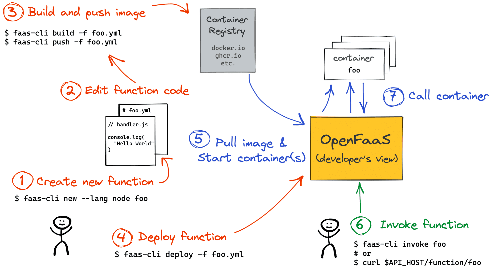
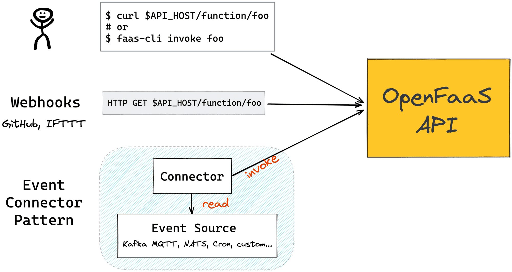
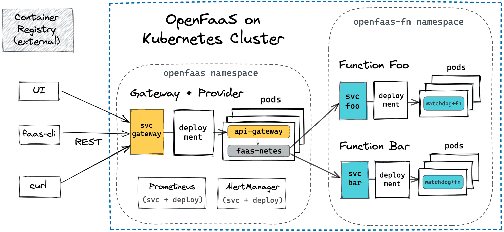
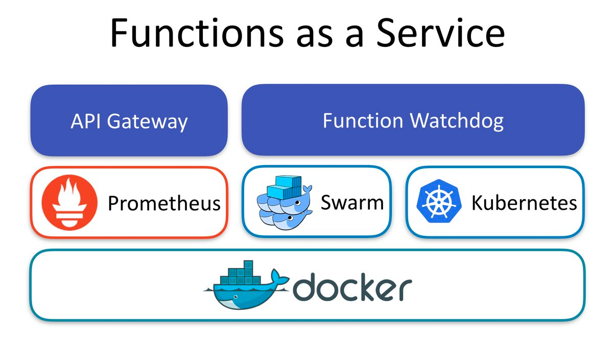
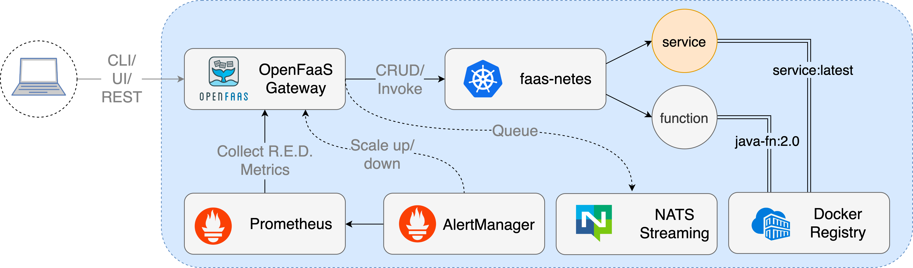

## 基于 of-watchdog 的自研 FaaS 定时调度平台

- 执行内部清理任务
- 执行爬虫同步任务
- 承接语言（node、python）
- 提供在线编辑代码的功能，编辑完直接部署
- 与 cron-connector 构建定时任务平台

```
export fprocess="python /Users/gaozhe/GolandProjects/vpnbook/dev/of-watchdog/test/index.py"
export mode=serializing
go build .
brew install faas-cli
```

## 原生of-watchdog

```
1. http: 不使用该mode, http或者grpc服务将直接使用k8s调度    （使用 http request）
2. serializing：原生 watchdog模式    （底层 cmd 直接执行命令）  脚本场景
3. streaming: 流模式  （底层 cmd 直接执行命令）  反向代理   机器学习场景
4. static: 静态文件模式 (直接是文件服务)

```

## 原理(https://atbug.com/openfaas-case-study-zh/)

```
1. open-faas 通过http直接调用被 watchdog 包装的镜像

2. oci: https://www.zeng.dev/post/20200510-container-oci/
   基于oci可以快速的更新代码，docker只会更新代码层的layer，其他的层的不变

3. 事件链接器
   定时任务触发：https://github.com/openfaas/cron-connector
   trriggers触发器：https://github.com/openfaas/mqtt-connector
   消息队列：https://github.com/openfaas/nats-connector

4. 集成
   apisix集成：
   raspberry-pi集成：可以直接 shell或者 python2.7
   收集群控：sekiro+rust+k3s

5. 定时任务
   https://docs.openfaas.com/reference/cron/
```




## openfaas k8s原理

```
nats： 异步任务
openfaas-gateway: 通过函数名称唤醒服务
faas-nets: 判断是 函数调用还是http调用 由 of-watchdog 进一步调用
prometheus: 监控用
```





## 命令

```
faas-cli login --username admin --password admin --gateway http://127.0.0.1:9999
faas-cli list --gateway http://127.0.0.1:9999

# 生成新函数
faas-cli new --lang python hello-python
# 本地构建
faas-cli build -f ./hello-python.yml --tag sha
# push到远程  注意这里需要登录远程 docker (You must provide a username or registry prefix to the Function's image such as user1/function1)
docker login --username=sdga****@qq.com registry.cn-shanghai.aliyuncs.com
faas-cli push -f ./hello-python.yml
# 部署 注意 k8s 容器的命名空间
faas-cli deploy -f ./hello-python.yml  --gateway http://127.0.0.1:9999
# 删除函数
faas remove hello-python --gateway http://127.0.0.1:9999
# 模版
模版可以自定义 template
# 测试
docker run -dti -p 5671:8080 --name test_func registry.cn-shanghai.aliyuncs.com/vpnbook/github:latest
```

## 开源文章

```
https://juejin.cn/post/7114964607587844103
https://atbug.com/openfaas-case-study-zh/
```